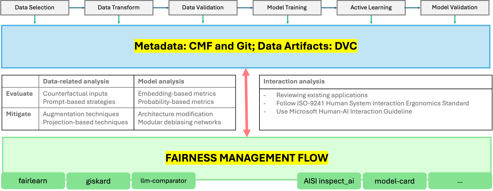
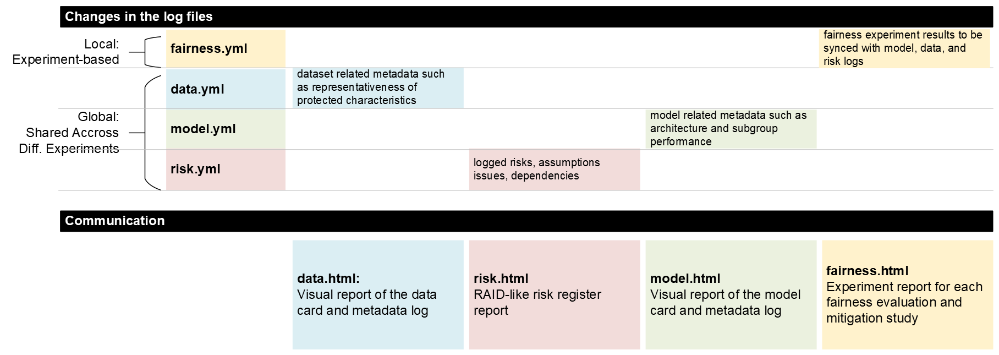

# Fair AI Development

> **Research Preview Disclaimer:** This repository contains code, data, and materials that are part of an ongoing research project. Please note that the work is in a **research preview** stage and may produce incomplete or inconsistent results. Use at your own discretion, and feel free to contribute or report any issues.

This repository showcases the use of existing metadata for fairness monitoring. 

> See all demos: [Demo List](./demos/README.md)

Achieving fairness in product development is a shared responsibility among all stakeholders, including developers, business analysts, product owners, designers, and user researchers. So, all parties need to actively feel the responsibility to share the design decisions with each other. This repository presents a set of useful functions and templates to support development teams to share fairness and safety related metadata, risks, and transparency reports. The demo tutorials showcases the use of common fairness libraries and frameworks such as fairlearn, AISI's inspect_ai, WEFE (word embedding fairness), etc.

Throughout the development lifecycle, a fairness log is recorded for very experiment, and it informs the model, data, risk and transparency logs in system level.

## Logging fairness related metadata

- `📂 faid/logging` includes all logging-related functionalities such as initiating the metadata files, populating and syncing them. 
- `📂 faid/logging/templates` are empty YML files with the core metadata formats: Data, model, fairness, risks, and transparency.

> The metadata templates are available with descriptions. See [templates with example descriptions](./faid/logging/template_example_descriptions/).

**Logging** is the core of this repository. All other functionalities (report and scan) depends on logging utilities. So, you should start with integrating it.

### Reporting

- `📂 faid/report` includes utility functions for generating reports. The reports visualise the metadata in a friendly graphical format.
- `📂 faid/report/schema` contains the ontology of fairness notions and metrics to create standardised visualisations.
- `📂 faid/report/templates` includes [Jinja](https://jinja.palletsprojects.com/en/stable/) templates for generating HTML templates for automatically translating the existing metadata to reports.

### Scanning

- `📂 faid/scan` includes utility functions that scan the popular safety benchmarks to find existing fairness scores of the pre-trained models (only LLMs).
- `📂 faid/scan/unit_tests` includes example data unit tests that you can use throughout the development process.

> See the [Docs](./docs/) for more details.

## This repository is not...

- This repository is not a replacement of an existing experiment tracking library. Keep using your favourite experiment tracking tool (e.g. [wandb](https://wandb.ai/site), [Neptune](https://neptune.ai/), [mlflow](https://mlflow.org/)).  record fairness-related data in a standardised and interoperable way. 
- This repository is not a Python library. We don't want to abstract away the features. Throughout the development process, developers should take some time and think about their model safety and how to monitor them. Then, they can directly include logging, reporting or scanning source code to their codebases to customise the functionality.

