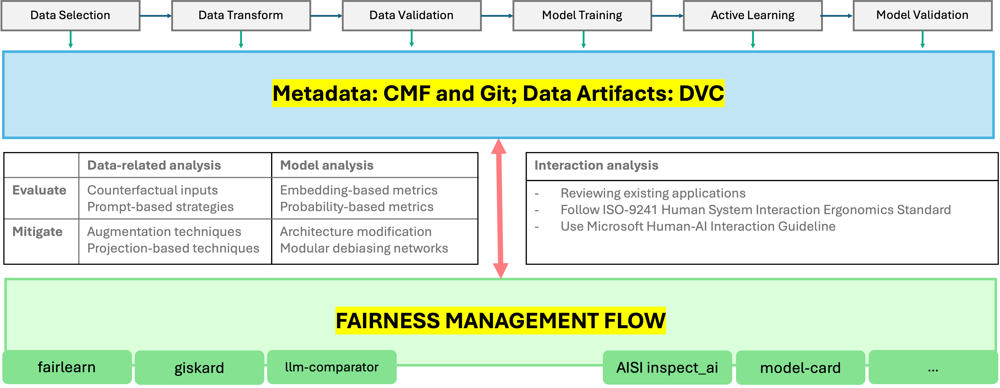

# FAID: Fair AI Development

Achieving fairness in product development is a shared responsibility among all stakeholders, including developers, business analysts, product owners, designers, and user researchers. FAID aims to help development teams to share fairness and safety related metadata, risks, and transparency reports easily and quickly. FAID also includes some helper functions to integrate common fairness libraries and frameworks such as fairlearn, AISI's inspect_ai, WEFE (word embedding fairness), etc.

The main idea of FAID is illustrated in below diagram:

Throughout the development lifecycle, a fairness log is recorded for very experiment, and it informs the model, data, risk and transparency logs in system level.