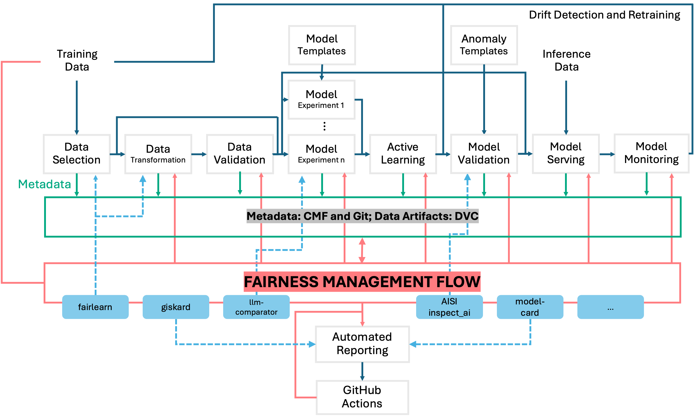
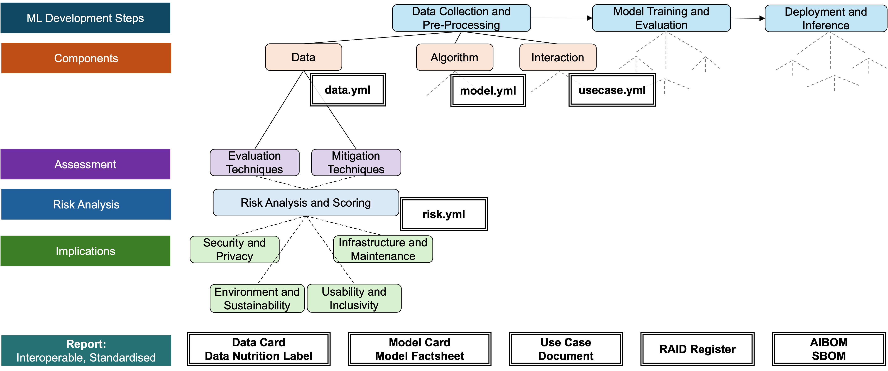
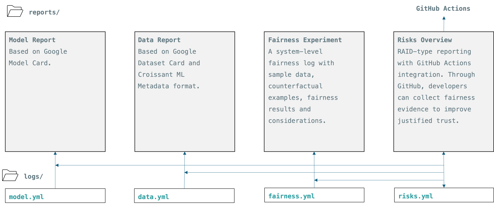
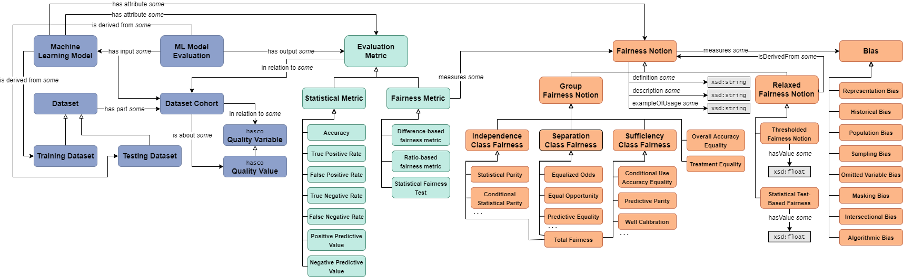

# FAID (Fair AI Development) Wiki

**Metadata Standards and Formats:**
- [Overview of Metadata Recording](./metadata/README.md)
- [Managing Metadata](./managing-metadata.md)

**Fairness-Oriented Risk Assessment:**
- [Self Assessment](./SELF-ASSESSMENT.md)
- [Management of Fairness-Related AI Risks](https://doi.org/10.5281/zenodo.14795320)

**Technical Diagrams:**

- Stages in ML Development

- Structured Assurance

- From Metadata to Reports

- Fairness Ontology (obtained from https://github.com/frankj-rpi/fairness-metrics-ontology)

