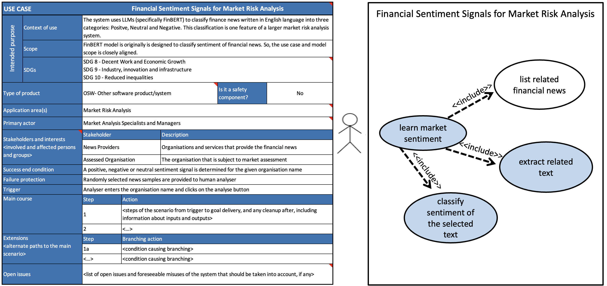

# Metadata Overview: Formats and Flow

Logging, updating, monitoring, and testing metadata can support developers in continuous monitoring of fairness as well as other safety characteristics. 

Below, we listed some of the most commonly used ML development-related metadata recording formats:

## Data Cards

> [See FAID metadata recording template for datasets](../../faid/logging/templates/data.yml)
> [See the metadata recording in action: Credit Risk Scoring Example](../../demos/credit-scoring-default/demo_credit_loan_decisions.ipynb)

Data cards provide detailed documentation of datasets used in training and evaluating ML models. They include information about data sources, preprocessing steps, limitations, and known biases, offering critical transparency about the data shaping model behaviour. This transparency is a valuable resource for identifying potential biases, evaluating model fairness, and understanding the broader sociotechnical challenges associated with the dataset [Pushkarna et al., 2022].

> **Fairness-related metadata:** Google's Data Card specification mandates details such as funding sources, data subjects, representation balances of potential sensitive characteristics, dataset collection process, geographies involved in both collection and labelling processes, intended use cases, and potential unintended outcomes.

## Model Cards

> [See FAID metadata recording template for models](../../faid/logging/templates/model.yml)
> [See the metadata recording in action: Financial Sentiment Analysis](../../demos/sentiment-analysis/demo-finbert.ipynb)
> 
Model cards provide essential information about an ML model's intended use, limitations, and performance. They typically include details like model purpose, dataset used, evaluation metrics, ethical considerations, and any limitations or potential biases. To illustrate, Google's model card specification includes nine main sections [Mitchell et al., 2019]: **(1)** Model details such as basic model information, **(2)** Intended use with the cases that were envisioned during development, **(3)** Factors could include demographic or phenotypic groups, environmental conditions, technical attributes, **(4)** Metrics chosen to reflect potential real world impacts of the model, **(5)** Evaluation data that was used for the quantitative analyses in the card, **(6)** Training data (when possible) to understand the distribution over various factors, **(7)** Quantitative analyses, **(8)** Ethical considerations, and **(9)** Caveats and recommendations. This information helps users and other stakeholders to understand where and how a model should (and shouldn't) be applied.

> **Fairness-related metadata:** "Data", "Performance Metrics", and "Considerations" field groups can be a valuable source to identify potential fairness issues. Entities with "Data" field can reveal potential representation bias and understand the sensitive characteristics. "Performance metrics of quantitative analysis" can include sensitive-group based analysis. If it is filled properly, provided confidence intervals show the statistical significance of these results. "Considerations" can support the next phase of requirement planning in an iterative development process. "License information" and its "SPDX" (System Package Data Exchange) link can reveal SBOM (software bill of materials) data for their development codebase. An SBOM document lists all the components that form a software, including dependencies like libraries and API calls, and their versions and licenses. Particular versions of development libraries can introduce some measurement and evaluation bias throughout the development process.

## Recording Fairness-Related Experiment Metadata

> [See FAID metadata recording template for fairness](../../faid/logging/templates/fairness.yml)
> [See the metadata recording in action: Financial Sentiment Analysis](../../demos/sentiment-analysis/demo-finbert.ipynb)

Although, model, data and use case cards store some fairness-related metadata, they are not designed to address potential fairness recording needs. We created a fairness recording template to support development teams documenting key details related to the experimental setup, data characteristics, model specifications, and fairness evaluation metrics. The metadata begins with general information, providing a comprehensive overview of the experimental context.

The "data" section captures the characteristics of the dataset, such as "sample" details and profiles of key "variables". It explicitly identifies "sensitive_characteristics" (e.g., race, gender) that may influence fairness outcomes, alongside the categorization of "nominal" and "continuous" features. The "model" section records the ML model's "name", ensuring traceability to the specific algorithm or architecture used. In the "sample_data" subsection, performance metrics such as true positives ("tps"), false positives ("fps"), true negatives ("tns"), and false negatives ("fns") are recorded, providing a foundation for quantitative analysis of model behaviour.

Finally, the "bias_metrics" section is pivotal in evaluating fairness. It organizes metrics by "groups", where each "group_name" corresponds to a demographic or attribute category (e.g., age group, gender). Within each group, metrics are detailed with attributes such as their "name", "description", "value", and corresponding "thresholds". Parameters such as whether a higher metric value is preferred ("bigger_is_better") and additional "notes" or "subgroup (sg)" parameters further enrich the analysis. By facilitating granular tracking and assessment of fairness across groups, this template provides a robust mechanism for identifying and addressing bias, ultimately fostering ethical and responsible ML development.

## Other Useful Formats for Aligning Business Value

### Risk Registers

> [See the risk register report of the Financial Sentiment example in the `📁 reports`](../../demos/sentiment-analysis/reports)

A risk register is a tool, commonly used in project management, to document, track, and manage potential risks that could impact a project's success. It typically includes details like the risk description, its likelihood, impact, owner, and mitigation strategies. FAID uses the RAID (Risks, Assumptions, Issues, Dependencies) framework to link fairness-related risks. In a RAID-based risk register recording, we identify risks (potential problems), list assumptions (conditions expected to hold true), note issues (current problems needing resolution), and document dependencies (external factors or tasks impacting the project). 

For each item, assign an owner, and link it to relevant Github issues. Then, outline mitigation or resolution actions to manage them effectively.

### Use Case Cards

> [See an example use case card of examples from finance sector](../finance-use-case-card-examples.xlsx). The template is obtained from [Hupont et al.'s (2024) paper](https://doi.org/10.1007/s10676-024-09757-7). You can use it to extend your existing design documents (UML diagrams, wireframes, etc.).

Based on the commonly used Unified Modelling Language (UML) in software engineering, Hupont et al. proposed use case cards as a standardized methodology to define intended purposes and operational uses of an AI system [Hupont et al., 2023]. A use case card consists of two main parts: (a) a canvas for visual modeling, and (b) a table for written descriptions. The canvas includes actors, use cases, and relationships, while the table provides additional details such as intended purpose, product type, safety component status, application areas, and other relevant information. Figure 1 illustrates a use case card created for a financial sentiment analysis system, that we conducted a heuristic walkthrough in Section 3.

> **Fairness-related metadata:** The EU AI Act alignment of the proposed use case card, and direct links to open issues gives a valuable system and organization level view on fairness challenges.

With our approach to argument-based assurance and several examples of evidence illustrated, we now turn to an illustrative example of how the methodology and transparency artifacts can be consolidated.